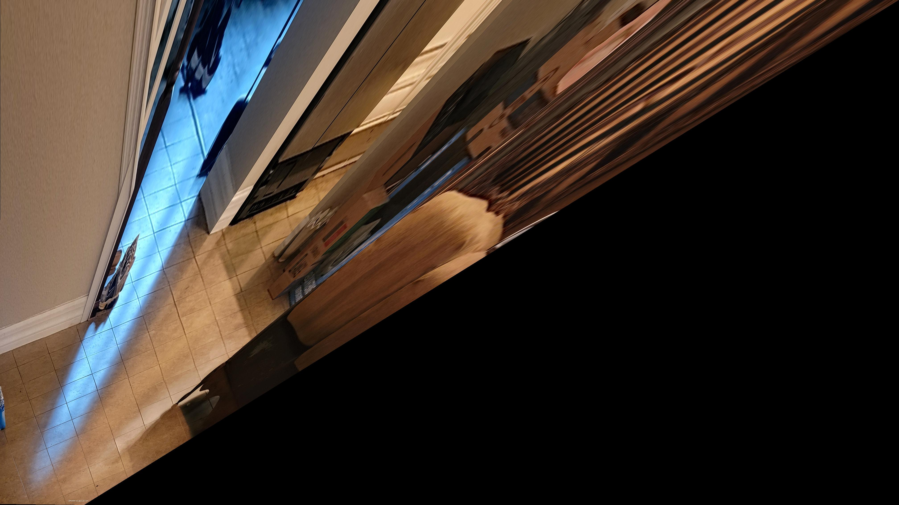
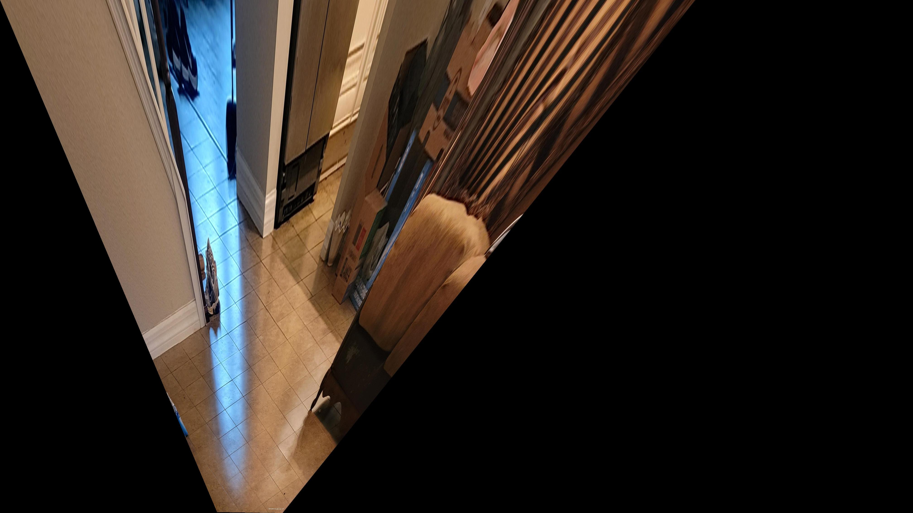
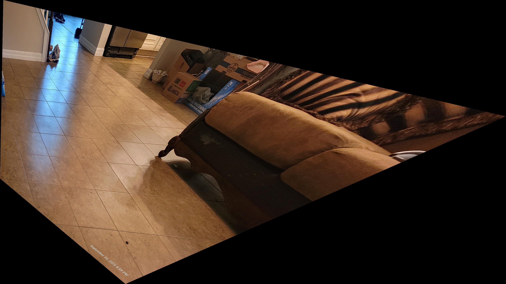

### Matlab Code to Rectify a Projective Distorted Image

Code in HW2 folder

#### Two Ways to Rectify:

1. **2 steps Rectification:**

   1. Select 2 pairs of parallel lines (4 lines in total) in the image to perform affine rectification.
   2. Select 2 pairs of perpendicular lines (4 lines in total) to perform metric rectification.

   Results are good.

    

    <figure style="width: 32%;">
        
        <figcaption>Original Image</figcaption>
    </figure>
    <figure style="width: 32%;">
        
        <figcaption>Affine Rectification</figcaption>
    </figure>
    <figure style="width: 32%;">
        
        <figcaption>Metric Rectification</figcaption>
    </figure>
    

2. **1 step Rectification:**
   Select 5 pairs of orthogonal lines (10 lines in total) in the image.

   Result not as good.

    <figure>
        
        <figcaption>1 step Rectification</figcaption>
    </figure>
